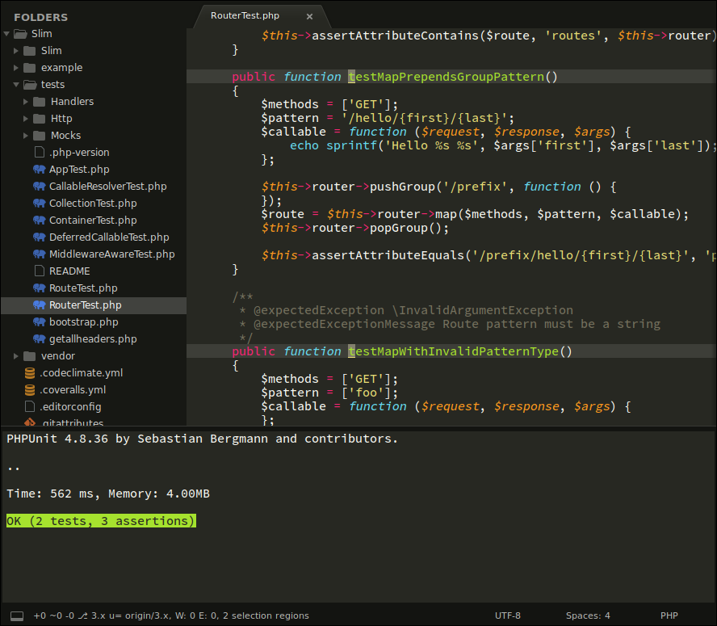

# PHPUnit

[](https://travis-ci.org/gerardroche/sublime-phpunit) [](https://ci.appveyor.com/project/gerardroche/sublime-phpunit/branch/master) [](https://coveralls.io/github/gerardroche/sublime-phpunit?branch=master) [](https://codecov.io/gh/gerardroche/sublime-phpunit/branch/master)

[](https://sublimetext.com) [](https://github.com/gerardroche/sublime-phpunit/tags) [](https://github.com/gerardroche/sublime-phpunit/stargazers) [](https://packagecontrol.io/packages/PHPUnitKit)

PHPUnit support for [Sublime Text](https://sublimetext.com).



## Features

* Run Test File
* Run Test Suite
* Run Nearest Test
* Run Last Test
* Fully customisable configuration
* Supports Composer installed PHPUnit
* Supports colour results, diffs, errors, etc.
* Jump to next and jump to previous failure

## Installation

### Package Control installation

The preferred method of installation is [Package Control](https://packagecontrol.io/packages/PHPUnitKit).

### Manual installation

Close Sublime Text, then download or clone the [repository](https://github.com/gerardroche/sublime-phpunit) to a directory named **PHPUnitKit** in the Sublime Text **Packages directory** for your platform:

OS | Command
-- | -----
Linux | `git clone https://github.com/gerardroche/sublime-phpunit.git ~/.config/sublime-text-3/Packages/PHPUnitKit`
OSX | `git clone https://github.com/gerardroche/sublime-phpunit.git ~/Library/Application\ Support/Sublime\ Text\ 3/Packages/PHPUnitKit`
Windows | `git clone https://github.com/gerardroche/sublime-phpunit.git %APPDATA%\Sublime/ Text/ 3/Packages/PHPUnitKit`

## Commands

All of the following commands are available via the Command Palette (press `Ctrl+Shift+p` (Win, Linux) or `Cmd+Shift+p` (OS X)) and are all prefixed with "PHPUnit: ".

command | description
------- | -----------
**TestSuite** | Runs the whole test suite (if the current file is a test file, runs that framework's test suite).
**TestFile** | In a test file runs all tests in the current file, otherwise runs that file's tests.
**TestNearest** | In a test file runs the test nearest to the cursor, otherwise runs that file's tests.
**TestLast** | Runs the last test.
**TestVisit** | Visits the test file from which you last run your tests (useful when you're trying to make a test pass, and you dive deep into application code and close your test buffer to make more space, and once you've made it pass you want to go back to the test file to write more tests).
**TestSwitch** | In a test file opens the file under test, otherwise opens the test file.
**TestResults** | Opens the test results panel.
**TestCancel** | Cancels the test runner.
**TestCoverage** | Opens the code coverage report in default browser.
**ToggleOption** | Toggles PHPUnit options.

## Key Bindings

Add your preferred key bindings via **Menu > Preferences > Key Bindings** or the Command Palette (press `Ctrl+Shift+p` (Win, Linux) or `Cmd+Shift+p` (OS X), select "Preferences: Key Bindings" and press `enter`).

```json
[
    { "keys": ["ctrl+shift+a"], "command": "phpunit_test_suite" },
    { "keys": ["ctrl+shift+c"], "command": "phpunit_test_cancel" },
    { "keys": ["ctrl+shift+f"], "command": "phpunit_test_file" },
    { "keys": ["ctrl+shift+l"], "command": "phpunit_test_last" },
    { "keys": ["ctrl+shift+n"], "command": "phpunit_test_nearest" },
    { "keys": ["ctrl+shift+r"], "command": "phpunit_test_results" },
    { "keys": ["ctrl+shift+s"], "command": "phpunit_test_switch" },
    { "keys": ["ctrl+shift+v"], "command": "phpunit_test_visit" }
]
```

key | description
--- | -----------
`F4` | Jump to Next Failure
`Shift+F4` | Jump to Previous Failure

## Configuration

You can configure the plugin via **Menu > Preferences > Settings** or the Command Palette (press `Ctrl+Shift+p` (Win, Linux) or `Cmd+Shift+p` (OS X), select "Preferences: Settings" and press `enter`).

key | description | type | default
--- | ----------- | ---- | -------
`phpunit.options` | Default options to use when running PHPUnit. | `dict` | `{}`
`phpunit.composer` | Use PHPUnit installed by Composer? | `boolean` | `true`
`phpunit.executable` | Path to PHPUnit executable. | `string` | Auto discover using Composer or the system PATH
`phpunit.on_post_save` | List of events to trigger when a file is saved. | `list` | `[]`
`phpunit.php_executable` | Path to PHP executable. | `string` | Auto discover using the system PATH
`phpunit.save_all_on_run` | Save all dirty buffers before running tests. | `boolean` | `true`
`phpunit.strategy` | Execution environment. | `string` | `default` (output panel)

### phpunit.options

If you want some CLI options to stick around, you can configure them in your global preferences:

```
"phpunit.options": {
    "colors=never": true,
    "coverage-html": "build/coverage",
    "no-coverage": true,
    "d": ["display_errors=1", "xdebug.scream=0"]
}
```

The above transforms the options and passes them to the PHPUnit executable:

```
-d "display_errors=1" -d "xdebug.scream=0" --colors=never --coverage-html build/coverage --no-coverage
```

### phpunit.composer

When enabled, the test runner will use the PHPUnit executable installed by Composer, otherwise the system PATH will be used to find the executable. Composer support is enabled by default.

```
"phpunit.composer": true
```

### phpunit.executable

You can instruct the test runner to use a custom PHPUnit executable. The default is to auto discover one using Composer, if `phpunit.composer` is enabled, or using the system PATH.

```
"phpunit.executable": "~/path/to/bin/phpunit"
```

### phpunit.on_post_save

The "on post save" option allows you to trigger events after you save a file, for example you run the test file command (currently this is the only event supported). Defaults to `[]` (no events).

event | description
----- | -----------
`run_test_file` | Runs the the "test file" command for the active view.

```
"phpunit.on_post_save": ["run_test_file"]
```

### phpunit.php_executable

You can instruct the test runner to use a custom PHP executable. The default is to auto discover one using the system PATH.

```
"phpunit.php_executable": "~/.phpenv/versions/7.3.1/bin/php"
```

### phpunit.save_all_on_run

You can automatically save all views that have unsaved buffers (dirty buffers) *before* tests are run. Defaults to true.

```
"phpunit.save_all_on_run": true
```

### phpunit.strategy

You can run tests using different execution environments. Here is a table of available environments. The default is to use Sublime's builtin build panel.

strategy | identifier | description
-------- | ---------- | -----------
**Panel** | `default` | Runs test commands in a panel at the bottom of your editor window.
**iTerm2.app** | `iterm` | Sends test commands to iTerm2 >= 2.9 (useful in MacVim GUI).

```
"phpunit.strategy": "iterm"
```

## Custom commands

Aside from the main commands out-of-the-box, you can create your own custom test commands. The commands `phpunit_test_suite`, `phpunit_test_file`, `phpunit_test_nearest` accept any CLI option accepted by PHPUnit:

```
// Key Binding to run two specific test suites
{"keys": ["ctrl+shift+a"], "command": "test_suite", "args": {"testsuite": "fizz,buzz"}},

// Key Binding to run test suite with code coverage
{"keys": ["ctrl+shift+c"], "command": "test_suite", "args": {"coverage-html": "build/coverage"}},
```

## Contributing

See [CONTRIBUTING.md](CONTRIBUTING.md).

## Changelog

See [CHANGELOG.md](CHANGELOG.md).

## Credits

Based initially on, and inspired by, [maltize/sublime-text-2-ruby-tests](https://github.com/maltize/sublime-text-2-ruby-tests), [stuartherbert/sublime-phpunit](https://github.com/stuartherbert/sublime-phpunit), and [janko-m/vim-test](https://github.com/janko-m/vim-test).

## License

Released under the [BSD 3-Clause License](LICENSE).
